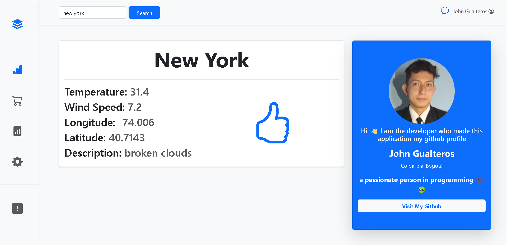

<h1 style="text-align:center;font-size:3rem;">Final Result</h1>

project made in python with the django framework everything was done by me use bootstrap and call 2 apis the one from github to show my profile and the one from OpenWeather to show the weather and other things you can search for any city in the world
